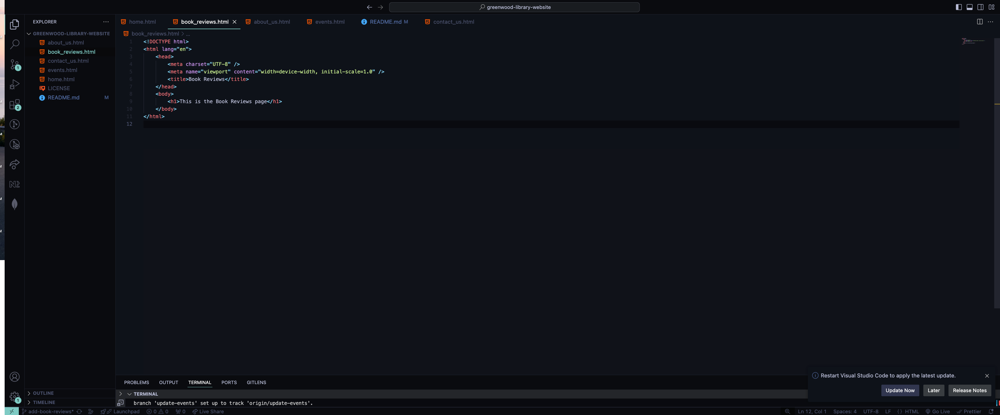
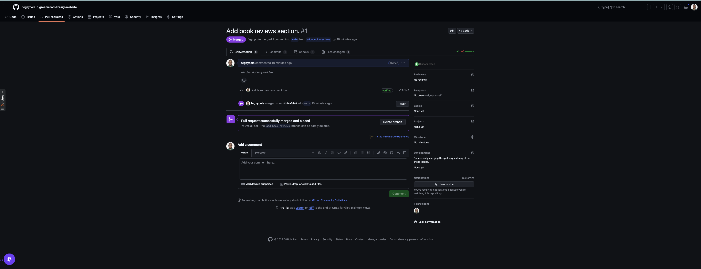
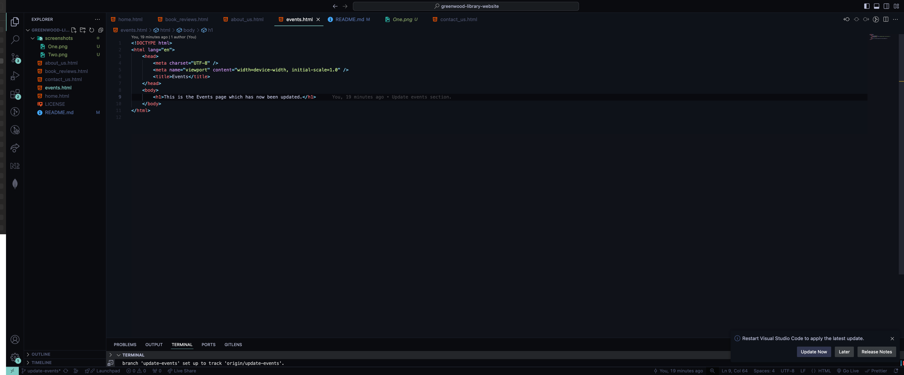
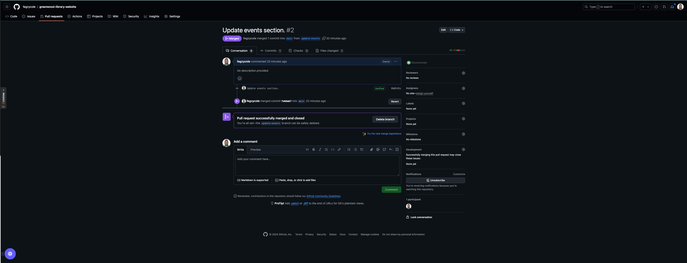

Git Capstone Project

-   The first step was to create the **add-book-reviews** branch. Inside the branch, I created a **book_reviews.html** file and added a html boilerplate
    
-   Next, I created a PR and merged it to the main branch.
    
-   Then I created the **update-events** branch. Inside this branch, I updated the content of the **events.html**
    
-   Finally, I created a PR and merged it to the main branch.
    